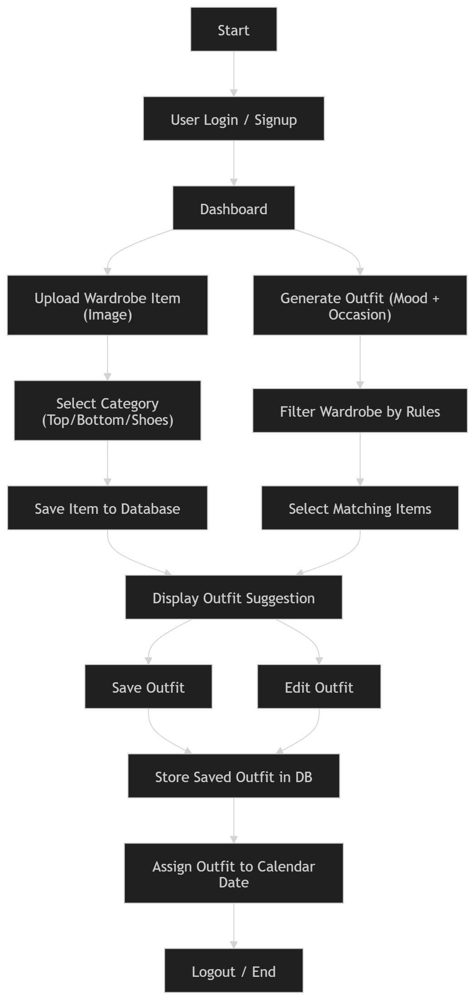
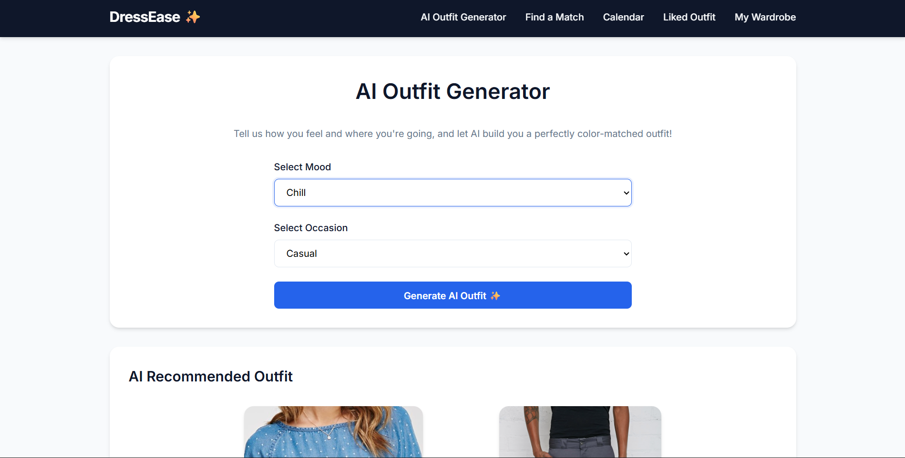
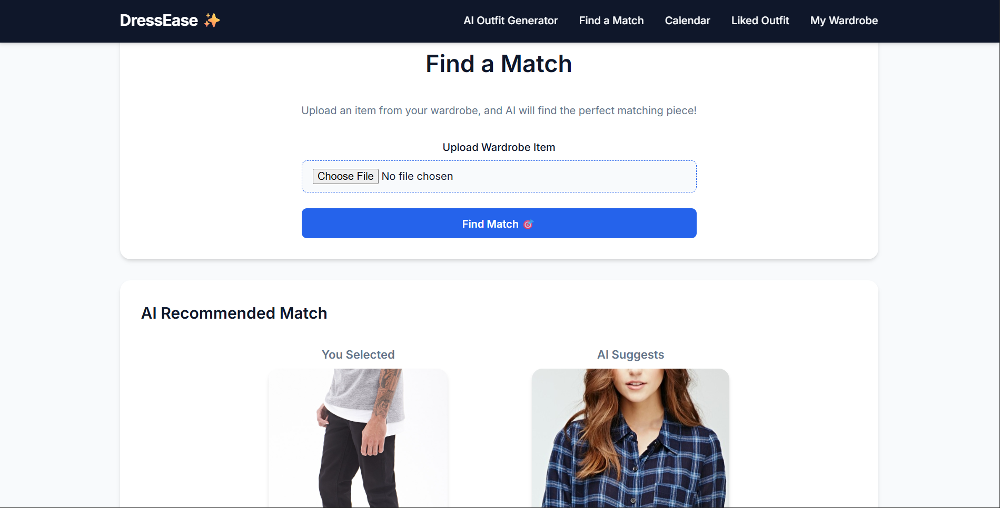
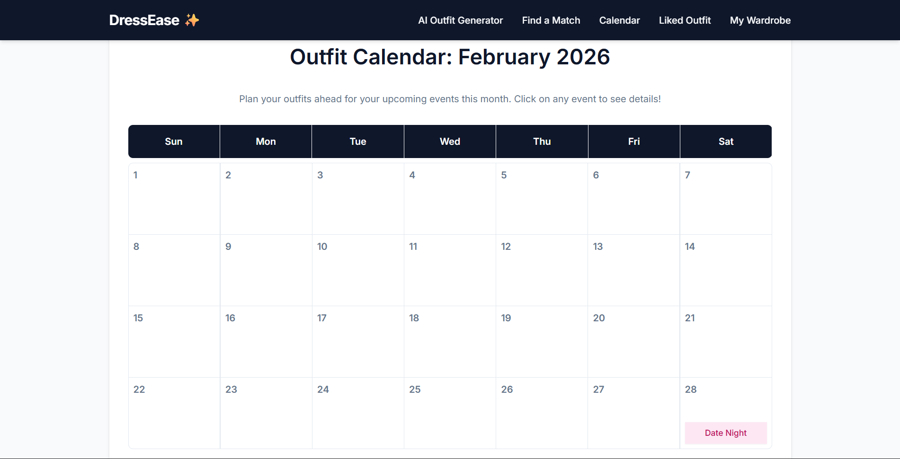
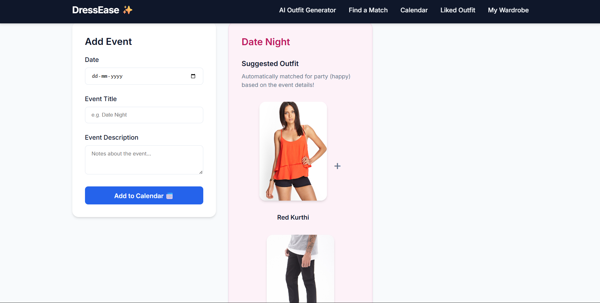
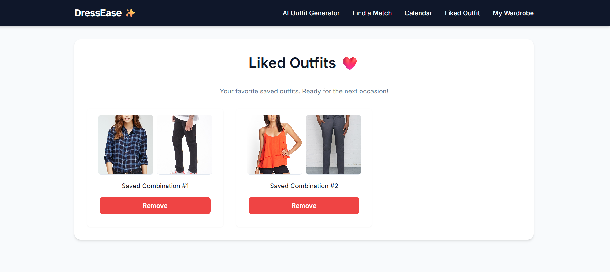

<p align="center">
  
</p>

<h1 align="center">DRESSEASE 🎯</h1>
<p align="center"><em>Your AI-powered wardrobe & styling companion</em></p>

<p align="center">
  <a href="https://dressease-production.up.railway.app">🔗 Live Demo</a>
</p>

---

## 👥 Team ByteX

| Member | College | Role |
|--------|---------|------|
| Akshara Arun | College of Engineering Thalassery | Frontend Development, API Integration |
| Devapriya R P | College of Engineering Thalassery | Backend Development, Database Design |

---

## 📌 About the Project

### The Problem
Choosing the right outfit daily is time-consuming and frustrating. People struggle to fully utilise their wardrobe, often repeating the same combinations — and buy new clothes without knowing if they'll match anything they already own.

### The Solution
DressEase is an AI-powered wardrobe management system that automatically generates coordinated outfits from your digital wardrobe. It analyses clothing type, color compatibility, mood, occasion, and calendar events to suggest stylish, appropriate combinations — making outfit planning faster and smarter.

---

## ✨ Features

- **AI Outfit Generator** — Suggests outfits based on mood and occasion
- **Image-Based Match Finder** — Find matching pieces for any selected garment
- **Calendar Integration** — Outfit recommendations based on upcoming events
- **Dynamic Wardrobe** — Upload new clothes and watch your wardrobe update automatically
- **Color Combination Engine** — Smart color harmony logic for well-coordinated looks
- **Multi-page Navigation** — Clean, intuitive interface

---

## 🛠️ Tech Stack

| Category | Technologies |
|----------|-------------|
| Languages | Python, JavaScript, HTML, CSS |
| Backend | Flask, TensorFlow, OpenCV, Scikit-learn |
| Libraries | NumPy, Pillow, Scikit-learn |
| Tools | VS Code, Git & GitHub, Kaggle |

---

## 🚀 Getting Started

### Installation

```bash
# Create and activate virtual environment
python -m venv venv
source venv/bin/activate  # Windows: venv\Scripts\activate

# Install dependencies
pip install flask tensorflow opencv-python numpy pillow scikit-learn
```

### Run

```bash
cd dressease
python app.py
```

---

## 🏗️ Architecture

The app follows a client–server architecture. The **frontend** (HTML, CSS, JavaScript) handles user interaction, while the **Flask backend** processes requests and runs the AI matching logic.

The system loads wardrobe images, detects clothing type and color, applies pairing and color rules, and returns outfit suggestions. The calendar module maps events to styling preferences for event-based recommendations.

### Workflow



1. User logs in → accesses dashboard
2. Upload wardrobe items → auto-categorised and stored
3. Generate outfit → filtered by mood, occasion, or calendar event
4. Save or edit the suggestion → optionally assign to a calendar date

---

## 📸 Screenshots

<p align="center"><br><em>AI outfit suggestions by mood & occasion</em></p>
<p align="center"><br><em>Image-based match finder</em></p>
<p align="center"><br><em>Calendar view</em></p>
<p align="center"><br><em>Calendar-planned outfit based on event</em></p>
<p align="center"><br><em>Liked outfits</em></p>
<p align="center"><br><em>Virtual wardrobe</em></p>

---

## 🎬 Demo

[📹 Watch the demo video](https://drive.google.com/drive/folders/1QrvhDS9hYXEq9oieU8V9TkYXDmN8nGXm?usp=sharing)

---

## 🤖 AI Tools Used

| Tool | Purpose |
|------|---------|
| GitHub Copilot | Boilerplate generation, code completion |
| Antigravity | Debugging async functions, code navigation |
| v0.dev | UI component scaffolding |
| ChatGPT / Claude | Code review, optimisation, debugging assistance |

**~50% of code was AI-generated.** Human contributions include architecture design, custom business logic, integration, testing, and all UI/UX decisions.

---

## 📄 License

This project is licensed under the [MIT License](LICENSE).

---

<p align="center">Made with ❤️ at TinkerHub</p>
